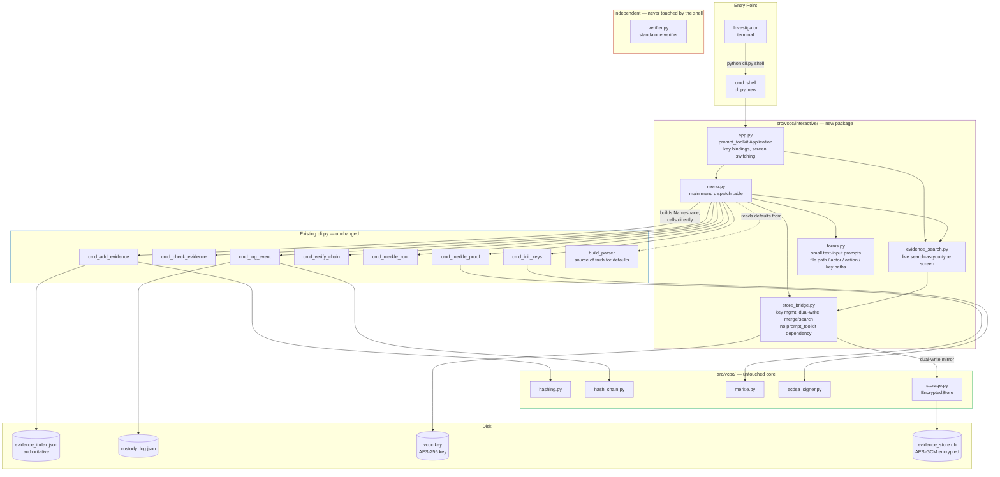
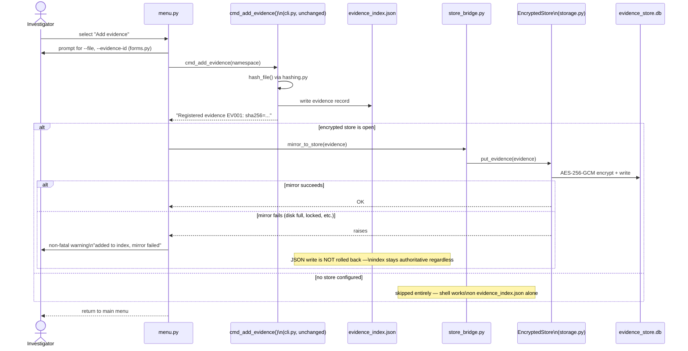
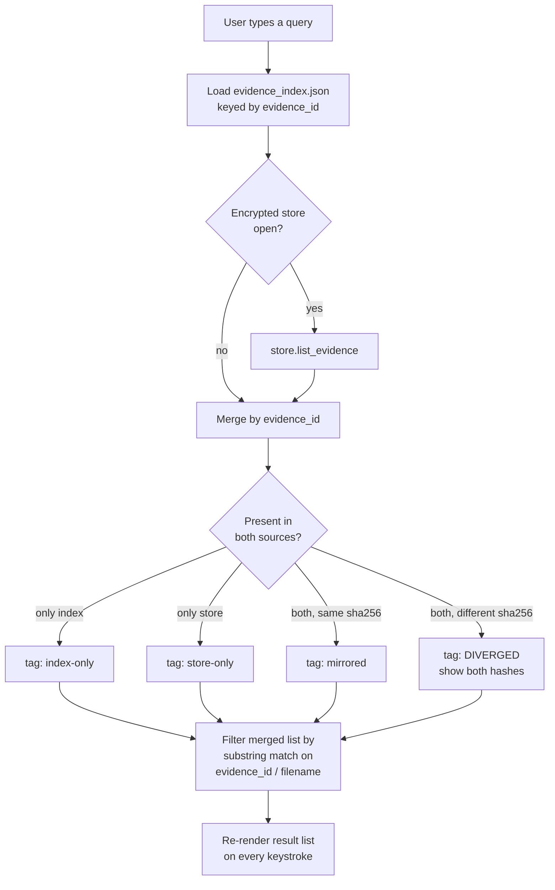

# Interactive CLI Shell — Architecture and Preview

### Verifiable Chain-of-Custody for Digital Evidence Files

**Team 21** | Chilakapati Srijaya Chakradhar, Gogineni Nikhil Sai, Pusunuru Preetham
**Supervisor:** Dr. Archana Kalidindi, Assistant Professor, CSE

---

## Purpose

`cli.py` today requires a full one-shot invocation per action —
`python cli.py add-evidence --file sample.bin --evidence-id EV001`, and so
on for all seven subcommands. This document specifies the architecture for
an **interactive, arrow-key-driven shell** built on top of `cli.py` — a
menu-and-search interface for a single investigator working on their own
machine, in the spirit of REPL-style tools like Claude Code's own CLI.

This is the **personal/local** interface. It is permanent, not a stopgap —
see `Doc/Future Scope/Extended_Architecture_and_System_Design.md` §9 for how
it relates to the separate, future-scope **web interface**, which targets
organizations self-hosting their own deployment. The two are parallel,
independent front ends over the same `vcoc/` core engine; this document
covers only the CLI shell. Implementation tasks are tracked in
`tasks/plan.md` and `tasks/todo.md`.

---

## 1. Design Principles

| Principle | What it means here |
|---|---|
| **Additive, not a replacement** | `python cli.py <subcommand> --flags` keeps working byte-for-byte unchanged. The shell is a new `shell` subcommand. |
| **Reuse, not reimplementation** | The shell never re-implements argument parsing or business logic. It builds an `argparse.Namespace` and calls the existing `cmd_add_evidence`, `cmd_check_evidence`, `cmd_log_event`, `cmd_verify_chain`, `cmd_merkle_root`, `cmd_merkle_proof`, `cmd_init_keys` functions directly. |
| **`verifier.py` stays untouched** | Nothing in the shell imports `verifier.py` or is imported by it. Its independent, decoupled trust model (see `PRC-2_Architecture_and_Tools.md` §1.5) is unaffected. |
| **JSON index stays authoritative** | `evidence_index.json` remains the source of truth every command reads from. The optional `EncryptedStore` mirror is additive and best-effort, never a silent replacement. |
| **Tamper/desync signals are surfaced, not hidden** | If the JSON index and the encrypted mirror disagree, the shell shows that divergence rather than merging it away — consistent with the project's whole reason for existing. |

---

## 2. Component Architecture



**Reading the diagram:** the shell (purple) is a thin orchestration layer.
Every actual side effect — hashing a file, appending to the chain, signing,
writing the encrypted store — happens inside code that already existed
before this feature. `verifier.py` (red) has no edge connecting it to
anything in the `Interactive` subgraph, by design.

---

## 3. Data Flow: Add Evidence (Dual-Write)

Shows the one place the shell does genuinely new integration work: mirroring
a newly-added evidence record into the encrypted SQLite store, alongside the
JSON index every other command already trusts.



Key property: the JSON write always happens first and is never undone by a
later mirror failure. `evidence_index.json` is the one thing every existing
`cmd_*` function depends on, so it can never be made to depend on a step
that is new, optional, and can fail (the encrypted mirror).

---

## 4. Search Reconciliation Logic

`store_bridge.search()` is a pure function — no `prompt_toolkit` dependency
— so it is unit-testable without a terminal. It merges two sources and tags
every result rather than silently picking one:



`DIVERGED` is treated as a signal worth surfacing, not an error to resolve
automatically — a mismatch between the two copies of a record is exactly
the kind of thing this project exists to detect.

---

## 5. Preview: What the Shell Looks Like

### 5.1 Main menu

```
┌─ Verifiable Chain-of-Custody — Interactive Shell ───────────────────┐
│                                                                      │
│   ▸ 1  Add evidence                                                 │
│     2  Search / browse evidence                                     │
│     3  Check evidence integrity                                     │
│     4  Log custody event                                            │
│     5  Verify chain                                                 │
│     6  Merkle root                                                  │
│     7  Merkle proof                                                 │
│     8  Generate keypair (init-keys)                                 │
│     9  Quit                                                         │
│                                                                      │
├──────────────────────────────────────────────────────────────────── │
│ ↑/↓ navigate   1-9 jump   Enter select   Esc/q quit                 │
└──────────────────────────────────────────────────────────────────── ┘
```

### 5.2 Live search-as-you-type

Typing `EV0` filters on every keystroke, tagging results by source:

```
┌─ Search / Browse Evidence ───────────────────────────────────────────┐
│ Query: EV0▏                                                          │
├───────────────────────────────────────────────────────────────────── │
│ ▸ EV001   sample_disk_image.dd        31df...aac   [mirrored]        │
│   EV002   memory_dump.raw             9c4a...110   [index-only]      │
│   EV003   browser_cache.zip           7be2...004   [DIVERGED]  ⚠     │
│     index sha256:  7be2...004                                        │
│     store sha256:  a91f...ee2                                        │
│                                                                       │
├───────────────────────────────────────────────────────────────────── │
│ ↑/↓ select   Enter choose   Ctrl-R refresh   Esc cancel               │
└───────────────────────────────────────────────────────────────────── ┘
```

### 5.3 Example session — worked walkthrough

```
$ python cli.py shell

Verifiable Chain-of-Custody — Interactive Shell
  ▸ 1  Add evidence
    ...

[user presses 1]

Add evidence
  File path: samples/sample_evidence.txt
  Evidence ID: EV001

Registered evidence EV001: sha256=31dfaca9779bee263961d72c6738cb62c6279326b7b4f00c27b8900d97485aac

No encrypted store key found. Generate one now at vcoc.key? [y/N]: y
  Wrote key -> vcoc.key
  Mirrored EV001 to evidence_store.db

[press any key to return to menu]

[user presses 4 — Log custody event]

Log custody event
  Search evidence: EV0▏
  ▸ EV001   sample_evidence.txt   31df...aac   [mirrored]
  [Enter to select EV001]

  Actor: J. Doe
  Action: collected

Logged event #0: collected on EV001 by J. Doe
entry_hash=1a2b3c...

[press any key to return to menu]

[user presses 5 — Verify chain]

OK: chain of 1 entries verified independently (chain verified).

[press any key to return to menu]

[user presses 9 — Quit]
$
```

Every line of output above is produced by the **existing, unmodified**
`cmd_add_evidence`, `cmd_log_event`, and `cmd_verify_chain` functions — the
shell only collects the inputs interactively and renders the same text
those functions already print via `python cli.py <subcommand>`.

---

## 6. Menu Action → Existing Command Mapping

| Menu item | Argument collection | Calls (unchanged) |
|---|---|---|
| Add evidence | `forms.py`: file path, evidence ID | `cmd_add_evidence` |
| Search / browse evidence | live search (§4) | `store_bridge.search` (new, read-only) |
| Check evidence integrity | search → pick evidence_id, then file path | `cmd_check_evidence` |
| Log custody event | search → pick evidence_id, then actor/action | `cmd_log_event` |
| Verify chain | none — uses `build_parser()` defaults | `cmd_verify_chain` |
| Merkle root | none | `cmd_merkle_root` |
| Merkle proof | search → pick evidence_id, optional output path | `cmd_merkle_proof` |
| Generate keypair | confirm/override default key paths | `cmd_init_keys` |
| Quit | — | closes `EncryptedStore` if open, exits `Application` |

---

## 7. What This Does Not Change

- `verifier.py` — zero edges to/from the `Interactive` package (§2).
- The one-shot CLI — `python cli.py <subcommand> --flags` is unmodified and
  untested-against-regression by every task in `tasks/todo.md`.
- `evidence_index.json` as the authoritative record every existing command
  reads — the encrypted mirror is additive, never a replacement.
- The relationship to the future-scope web interface: this shell's storage
  (JSON index + local `EncryptedStore` mirror) is scoped to personal/local
  use and is not the backend the future web interface will use — that gets
  its own relational schema per `Extended_Architecture_and_System_Design.md`
  §3.1 and §9.

---

## References

- `tasks/plan.md`, `tasks/todo.md` — implementation task breakdown
- `cli.py`, `src/vcoc/storage.py` — code this design wraps
- `Doc/PRC-2_Architecture_and_Tools.md` — base system architecture and
  verifier-independence design principle
- `Doc/Future Scope/Extended_Architecture_and_System_Design.md` §9 —
  CLI-vs-web interface strategy
