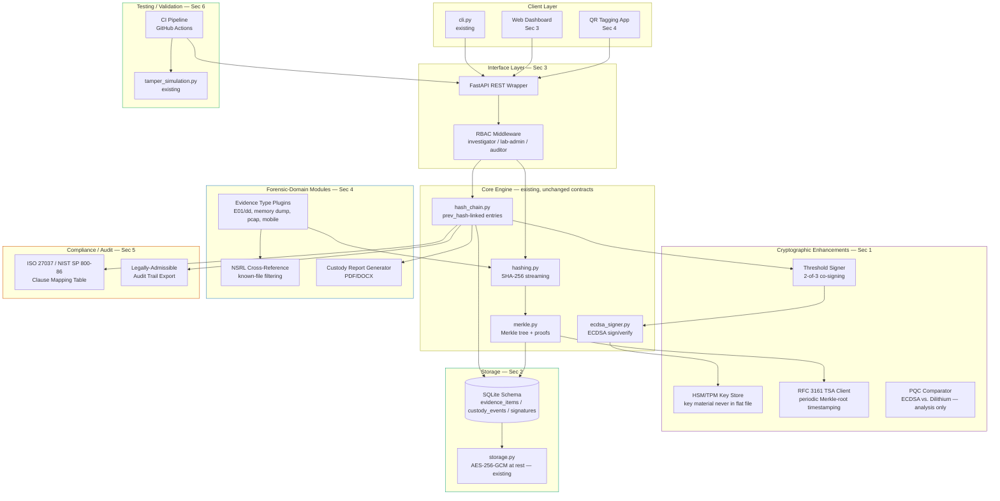
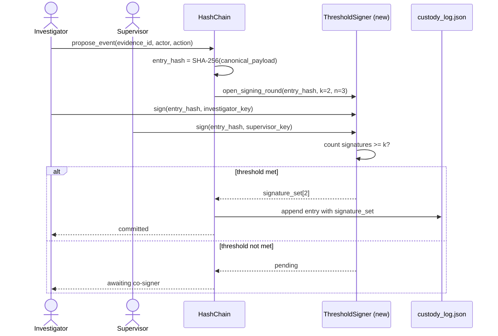
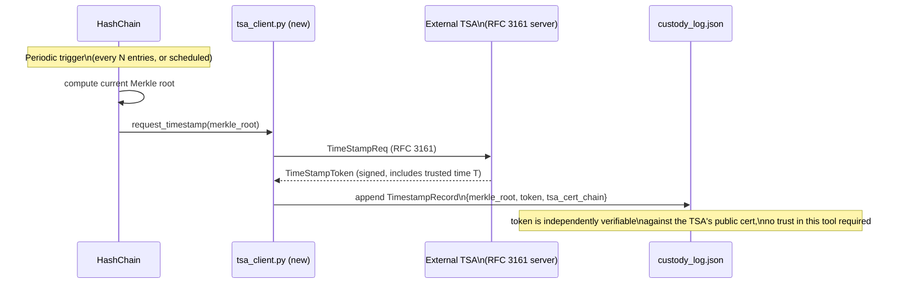
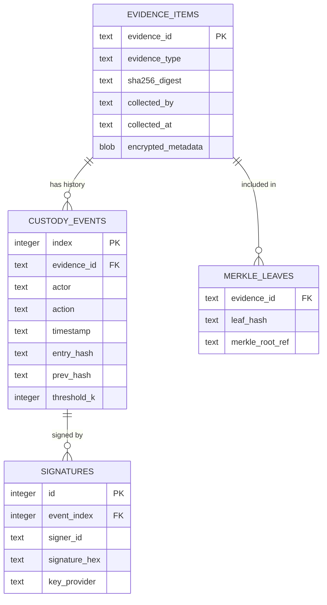
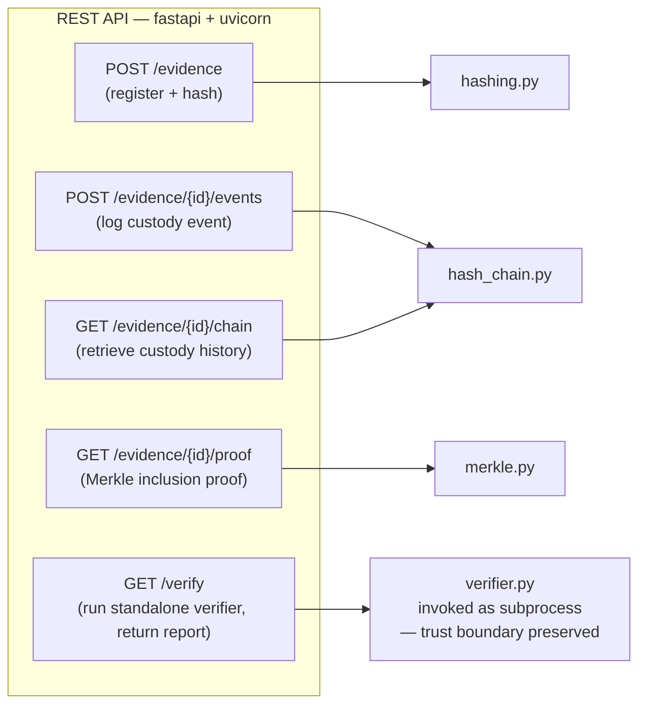
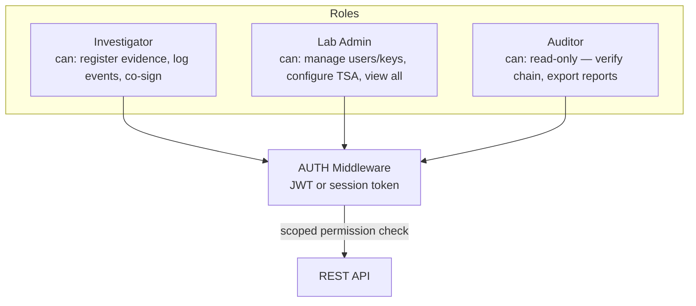
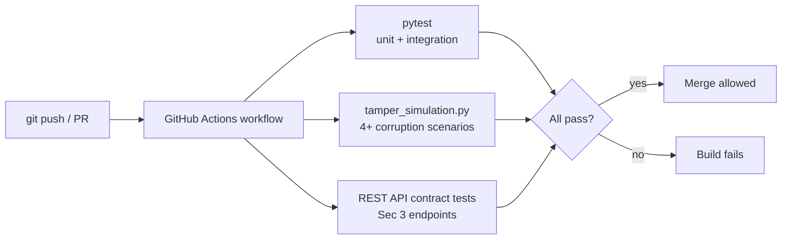
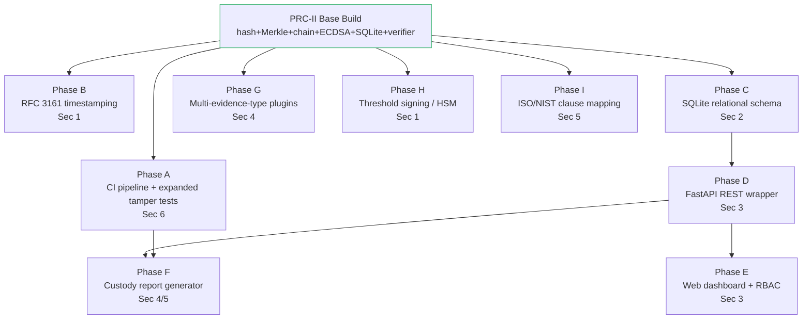

# Extended Architecture and System Design
### Verifiable Chain-of-Custody for Digital Evidence Files — Future-Scope Integration

**Team 21** | Chilakapati Srijaya Chakradhar, Gogineni Nikhil Sai, Pusunuru Preetham
**Supervisor:** Dr. Archana Kalidindi, Assistant Professor, CSE

---

## Purpose

`PRC-2_Architecture_and_Tools.md` documents the architecture actually built
for PRC-II: hashing, Merkle proofs, a hash-chained custody log, ECDSA
signing, optional encrypted SQLite storage, and an independent verifier.

This document extends that architecture to show how the system **grows**
if the required future-scope items in `Future_Scope.md` (Sections 1–6) are
implemented. Section 7 (external anchoring via OpenTimestamps/public
blockchain) is explicitly **excluded** here as optional/out-of-scope per
the project thesis — the design below stays entirely inside the
single-custodian, no-consensus trust boundary.

The goal is a target-state architecture the current codebase can grow into
incrementally, module by module, without a rewrite. Every new component
maps to a future-scope line item and is labeled with its source section.

---

## 1. Target-State Component Map

**Reading the diagram:** the `Core` subgraph is the PRC-II implementation,
untouched. Every other subgraph is additive — new modules call into the
existing core rather than replacing it, so the current test suite and
verifier remain valid as extensions land.

---

## 2. Cryptographic Enhancements (Future Scope)

### 2.1 Threshold / multi-signature custody transfer

**What changes:** `add_event()` in `hash_chain.py` currently accepts one
`signing_key` and produces one signature per entry. The extended design
introduces a `ThresholdSigner` that collects *k*-of-*n* signatures (e.g.,
2-of-3: investigator + lab supervisor + evidence officer) before an entry
is considered committed.

- **Storage impact:** each `CustodyEvent` gains a `signatures: list` field
  instead of a single `signature` string. Backward compatibility: the
  verifier treats a single-signature entry as a `1-of-1` threshold case, so
  existing PRC-II logs remain valid without migration.
- **Verifier impact:** `verifier.py` gains a threshold check — an entry is
  valid only if `len(valid_signatures) >= k` for that entry's declared
  policy, still independent of `cli.py`.

### 2.2 HSM/TPM-backed key storage

**What changes:** `ecdsa_signer.py` currently loads a private key from a
flat PEM file. The extension introduces a `KeyProvider` interface with two
implementations:

| Provider | Backing | Use case |
|---|---|---|
| `FileKeyProvider` | Existing PEM-on-disk (default) | Dev/demo, matches current PRC-II build |
| `SoftHSMKeyProvider` | SoftHSMv2 (PKCS#11) software TPM emulator | Comparative analysis — key material never touches process memory as raw bytes outside PKCS#11 calls |

`ecdsa_signer.sign_message(key, digest)` becomes
`ecdsa_signer.sign_message(key_provider, digest)` — the signing call site
in `hash_chain.py` does not need to know which provider is active.

### 2.3 RFC 3161 trusted timestamping

**Strongest-fit extension per the future-scope table** — it reinforces the
thesis directly (external, standards-based "existed at time T" proof
without needing blockchain/consensus infrastructure).

- **New module:** `vcoc/tsa_client.py` — builds an RFC 3161 request over
  the current Merkle root, submits it to a configured TSA endpoint (e.g., a
  free/test TSA such as FreeTSA), and stores the returned token alongside
  the root.
- **Independent verification:** anyone with the TSA's public certificate
  can confirm the root existed at time *T* without trusting `vcoc` at all —
  directly extends the existing "independent verifier" design principle
  (§1.5 of the base architecture doc) to external time-anchoring.
- **Dependency:** adds one library (`rfc3161-client` or equivalent) and a
  network call at anchoring time only; the core hash-chain/Merkle path
  remains fully offline-capable.

### 2.4 Post-quantum signature comparison

Positioned as **forward-looking analysis, not a required implementation**
per the future-scope table. Target design: a `PQCComparator` benchmark
script (`scripts/pqc_comparison.py`) that signs/verifies the same
`entry_hash` payloads with ECDSA (SECP256k1, current) and a PQC scheme
(e.g., CRYSTALS-Dilithium via `liboqs-python`), then reports signature
size, sign/verify latency, and key size side by side — feeding a
comparative-analysis table in the paper's future-work section, without
changing the production signing path.

---

## 3. Storage / Backend (Future Scope)

### 3.1 SQLite schema (evidence items, custody events, signatures)

`storage.py` already implements an encrypted SQLite backend for opaque
blobs. The extension formalizes a **relational schema** so evidence
metadata and custody events are independently queryable (by auditors,
reports, dashboards) while every row's plaintext still passes through the
existing AES-256-GCM `EncryptedStore` before touching disk.

- Every column value is still encrypted before write via the existing
  `EncryptedStore` (row primary key bound as AEAD associated data, per the
  base architecture); the schema above is the **logical** shape queries
  operate on after decryption, not a plaintext-on-disk layout.
- This schema is what the REST API (§4) and web dashboard (§4) query
  against — the current flat-JSON `custody_log.json` path remains
  supported as the zero-dependency default for the CLI-only workflow.

### 3.2 Encrypted-at-rest metadata

Already implemented in the base build (`storage.py`, AES-256-GCM). The
extension is scope-only: applying the same `EncryptedStore` to the new
`evidence_items.encrypted_metadata` column (case notes, examiner remarks)
so free-text case details get the same confidentiality guarantee as
custody events.

---

## 4. Interface Layer (Future Scope)

### 4.1 REST API wrapper (FastAPI)

- **Design constraint carried over from the base architecture:** the REST
  layer calls `verifier.py` as an isolated subprocess/module import that
  shares no mutable state with the write path, preserving the "verifier is
  independent of the producing tool" property — a REST wrapper around
  verification must not become a shortcut that re-couples them.
- Endpoints are thin wrappers over existing `vcoc/` modules; no business
  logic moves into the API layer.

### 4.2 Web dashboard

Consumes the REST API only (no direct file/DB access) to visualize:

- Custody chain timeline per evidence item (actor, action, timestamp).
- Merkle tree integrity status — green/red indicator per evidence file,
  driven by `GET /verify`.
- Tamper alerts surfaced from the verifier's `TAMPER DETECTED at #index`
  output, with the failing entry highlighted.

This is explicitly a **read/visualize** layer — it never writes directly
to the custody log; all writes go through `POST /evidence/{id}/events`,
keeping one write path for auditability.

### 4.3 RBAC (role-based access control)

RBAC sits in front of the REST layer as middleware; the core `vcoc/`
modules remain role-agnostic (they trust whatever `actor` string the
authenticated caller supplies, same as today's CLI) — role enforcement is
purely about *which endpoints* a caller may reach, not a change to the
signing/verification logic itself.

---

## 5. Forensic-Domain-Specific Modules (Future Scope)

### 5.1 Multi-evidence-type support

`hashing.py`'s streaming SHA-256 already works on any byte stream. The
extension adds a thin plugin layer above it:

| Evidence type | Type-specific metadata extracted | Still hashed via existing `hashing.py`? |
|---|---|---|
| Disk image (E01/dd) | Volume/partition table, filesystem type | Yes — file treated as opaque byte stream |
| Memory dump | OS profile hint (for later Volatility-style analysis, out of scope) | Yes |
| PCAP network capture | Packet count, capture duration, interface | Yes |
| Mobile extraction | Device model, extraction tool signature | Yes |

Each plugin implements `extract_metadata(path) -> dict`; the digest
computation path is untouched, so tamper-evidence guarantees are identical
across evidence types.

### 5.2 NSRL hash-set cross-referencing

New module `vcoc/nsrl_lookup.py`: given a registered evidence file's
SHA-256 digest, checks it against a local copy of NIST's NSRL
known-file-hash set. Matches are flagged as "known OS/application file" in
the evidence index — informational only, does not affect custody-chain
integrity logic.

### 5.3 Automated custody report generator

Reuses the DOCX-generation approach already used for the paper draft
(`Doc/paper_draft_build/`). A new `scripts/generate_custody_report.py`
reads `custody_log.json` (or the SQLite schema, §3.1) and renders a
court-ready PDF/DOCX with: evidence metadata, full custody timeline,
signature/verification status per entry, and the verifier's summary
output — turning `verifier.py`'s machine-readable result into a
human-readable, presentable document.

### 5.4 QR-code evidence tagging

`evidence_id` (already the primary key throughout the system) is encoded
into a QR code at intake time and printed onto the physical evidence bag
label. Scanning the QR code opens the dashboard's evidence detail view
(`GET /evidence/{id}/chain`) — a one-way physical-to-digital link; no new
identifier scheme is introduced.

---

## 6. Compliance / Audit (Future Scope)

### 6.1 ISO/IEC 27037 & NIST SP 800-86 clause mapping

Extends the mapping already started in the base architecture doc
into a full clause-by-clause table:

| Standard clause | System component | Status |
|---|---|---|
| ISO 27037 §6.2 (Identification) | `add-evidence` / `hashing.py` | Implemented |
| ISO 27037 §6.3 (Collection/Acquisition) | Evidence-type plugins (§5.1) | Future scope |
| ISO 27037 §6.4 (Preservation) | `storage.py` (AES-256-GCM) | Implemented |
| ISO 27037 §6.5 (Accountability) | ECDSA signing, threshold signing (§2.1) | Partially implemented → extended |
| NIST SP 800-86 §3 (Data collection) | Evidence-type plugins (§5.1) | Future scope |
| NIST SP 800-86 §4 (Examination) | NSRL cross-reference (§5.2) | Future scope |
| NIST SP 800-86 (documentation) | Custody report generator (§5.3) | Future scope |

This table is the deliverable itself (low build effort, strengthens the
academic/report side per the future-scope suggestion) — it requires no new
code, only mapping existing and planned components to clause numbers.

### 6.2 Legally admissible audit-trail export

Builds directly on §5.3's report generator: adds a signed export mode
where the exported PDF/DOCX itself is hashed and the digest is appended as
a final custody-log entry ("evidence report exported, digest=..."), so the
export operation is itself part of the tamper-evident chain rather than an
untracked side channel.

---

## 7. Testing / Validation (Future Scope)

### 7.1 Tamper-simulation test suite

Already implemented (`scripts/tamper_simulation.py`). Extended coverage
target for future-scope modules: threshold-signature bypass attempts
(fewer than *k* valid signatures), TSA-token forgery detection, and
RBAC-boundary tests (an `Auditor`-scoped token attempting a write
endpoint).

### 7.2 CI pipeline (GitHub Actions)

`.github/workflows/ci.yml` runs `pytest` and `tamper_simulation.py` on
every push/PR; as REST and RBAC land, contract tests for those endpoints
are added to the same gate rather than a separate pipeline.

---

## 8. Incremental Adoption Path

The extensions above are designed to be added independently — none
requires another to already be in place, except where noted:

**Recommended pairing (per `Future_Scope.md`'s own suggested next step):**
Phase A + Phase B first (small footprint, directly reinforces the thesis,
strong demo value), then Phase C → D → E as the visual/demoable track, with
Phase I runnable in parallel at any point since it requires no code.

---

## 9. What Does *Not* Change

To keep this extension honest to the core thesis, the following remain
fixed across every phase above:

- **No consensus layer.** RBAC, REST, and the dashboard are access and
  presentation concerns, not agreement protocols — no phase introduces
  multi-node agreement on chain state.
- **No public/permissionless ledger.** The web dashboard and REST API are
  access-controlled (RBAC, §4.3); Section 7 of `Future_Scope.md` (external
  anchoring) is the only item that would touch a public system, and it is
  explicitly excluded from this design.
- **Verifier independence is preserved.** Every new client (dashboard, REST
  caller, report generator) reads through `verifier.py`'s logic or its
  output — none of them gain a second, divergent notion of "valid."
