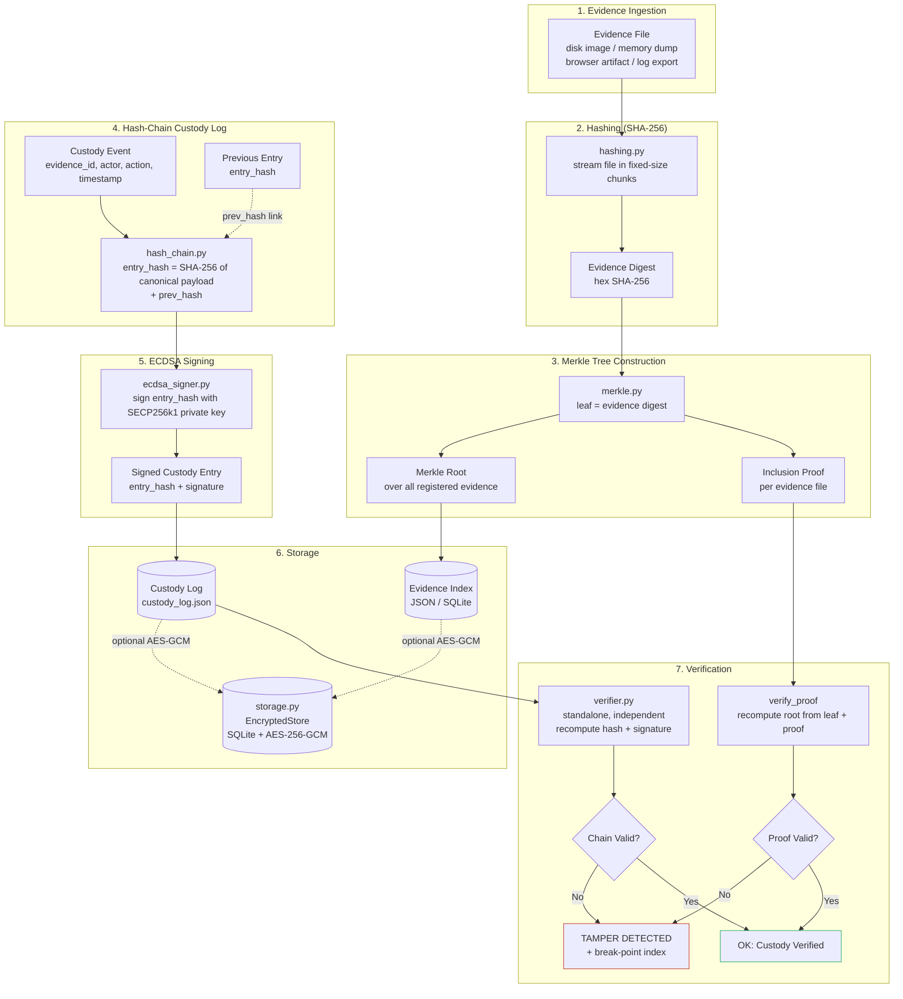
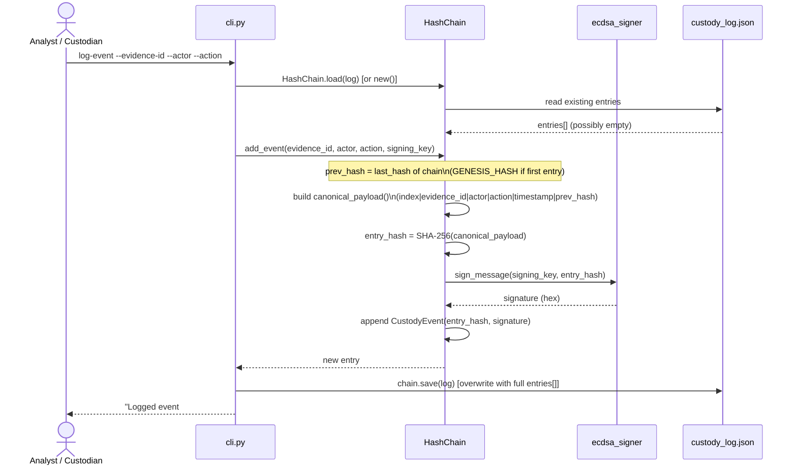
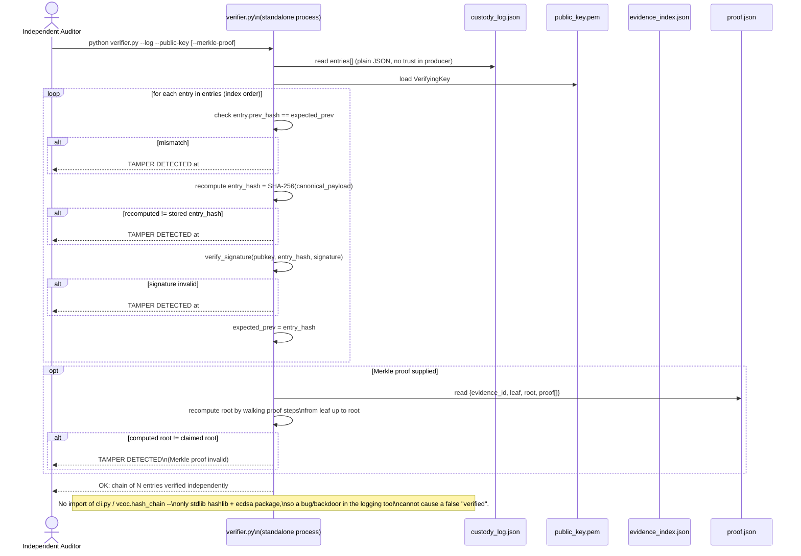

# PRC-II — Section 1 & 2: Architecture, Methodology, and Tools Justification

**Team 21** · Chilakapati Srijaya Chakradhar, Gogineni Nikhil Sai, Pusunuru Preetham
**Supervisor:** Dr. Archana Kalidindi, Assistant Professor, CSE

This document covers PRC-2 Plan Sections 1 (Methodology, System Design, and
Architecture) and 2 (Use of Modern Tools and Technologies), grounded in the
actual implementation in `src/vcoc/`, `cli.py`, `verifier.py`, and
`scripts/tamper_simulation.py`.

---

## 1. Methodology

### 1.1 Core thesis

A blockchain is not a single primitive — it is a bundle of independent
ingredients: content hashing, hash-linking of records into a chain,
a Merkle tree for efficient inclusion proofs, and asymmetric signing to bind
an actor's identity to an action, held together by a **consensus layer**
that lets multiple mutually-distrusting parties agree on one shared history
without a central authority.

Digital forensic evidence handling in a single accredited lab is not a
multi-party trust problem. There is one custodian (the lab), one system of
record, and no competing parties trying to rewrite history in parallel. What
the lab needs from "blockchain" is not distributed consensus — it is the
**tamper-evidence** properties consensus exists to protect: an append-only
record where altering any past entry is detectable, and a way for anyone
holding a public key to verify that record without trusting the tool that
produced it.

**Thesis:** single-custodian forensic integrity does not require distributed
consensus. This project takes the blockchain "ingredient list," keeps
hashing, hash-chaining, Merkle proofs, and digital signatures, and
deliberately excludes the consensus/mining/distributed-ledger layer, because
that layer solves a problem (multi-party agreement under adversarial
conditions) that does not exist here.

### 1.2 What each ingredient buys, and why it survives the cut

| Blockchain ingredient | Kept? | Role in this system |
|---|---|---|
| Cryptographic hashing (SHA-256) | Yes | Content-addresses every evidence file; the basis for detecting any byte-level change |
| Hash-linking of records | Yes | Custody log entries reference the previous entry's hash (`hash_chain.py`), so altering entry *N* invalidates every entry after it |
| Merkle tree | Yes | Lets a verifier confirm one file's inclusion in the evidence set without re-hashing every other file (`merkle.py`) |
| Asymmetric signatures | Yes | ECDSA binds a specific actor to a specific custody action (`ecdsa_signer.py`); a forged entry needs the private key, not just hash knowledge |
| Distributed consensus / mining | **No** | Solves multi-party disagreement, which does not exist under a single-custodian threat model (see 1.4) |
| Public/permissionless ledger | **No** | Evidence confidentiality is a requirement here, not a non-goal; a public ledger is the wrong shape for material that must stay access-controlled |

### 1.3 System architecture

Component responsibilities, mapped to actual modules:

- **Ingestion & hashing** (`vcoc/hashing.py`) — streams a file through SHA-256
  in fixed-size chunks so multi-gigabyte disk images/memory dumps never need
  to be loaded whole into memory.
- **Merkle tree construction** (`vcoc/merkle.py`) — one leaf per registered
  evidence file's digest; supports proof generation and verification with
  the standard duplicate-last-node rule for odd leaf counts.
- **Hash-chain custody log** (`vcoc/hash_chain.py`) — an append-only list of
  `CustodyEvent` records. Each entry's `entry_hash` is `SHA256(canonical
  payload || prev_hash)`; the genesis entry links to a fixed all-zero hash.
- **ECDSA signing** (`vcoc/ecdsa_signer.py`) — SECP256k1 keypair generation,
  signing of `entry_hash`, and verification.
- **Storage** (`vcoc/storage.py`) — optional SQLite backend where every row
  is an AES-256-GCM ciphertext blob, with the row's primary key bound in as
  AEAD associated data (defeats row-swap tampering, not just per-field
  corruption).
- **Verification** (`verifier.py`) — a standalone process, independent of
  `cli.py`, that re-derives every hash and signature check from the raw
  JSON log and public key alone.

### 1.4 Data-flow / sequence diagrams

Two operations are diagrammed in detail below.

**(a) Adding a custody event** — from CLI invocation through loading the
existing chain, computing the new `prev_hash`-linked entry, signing it, and
persisting the full log.

**(b) Verifying the chain end-to-end** — the independent verifier's
per-entry loop (prev-hash check → entry-hash recompute → signature check)
plus the optional Merkle-proof check, ending in either an `OK` or a
`TAMPER DETECTED` result naming the exact entry.

### 1.5 Threat model

**In scope (what this design defends against):**

- A single-custodian forensic lab, one system of record, one signing
  identity per custodian at a time.
- **Insider/tamper detection after the fact**: an analyst, or anyone with
  filesystem access to `custody_log.json` / the evidence store, edits a past
  entry (payload field, hash, or signature) or evidence file content. The
  hash chain and Merkle tree make this *detectable* by an independent
  verifier — not *prevented* at write time.
- **Verifier independence**: the standalone `verifier.py` must not share a
  trust root with the tool that produced the log, so a compromised or buggy
  `cli.py` cannot cause a false "verified" result.
- **Data-at-rest confidentiality**: if the optional SQLite backend is used,
  evidence metadata and custody events are encrypted (AES-256-GCM) so a
  stolen disk image of the storage file does not disclose case data, and
  tampered ciphertext fails to decrypt rather than silently returning
  corrupted plaintext.

**Explicitly out of scope (why no distributed consensus):**

- **Byzantine fault tolerance / multi-party consensus.** There is no set of
  mutually-distrusting nodes that must agree on one canonical history. If
  that changed (e.g., evidence shared and independently attested across
  multiple labs with no shared trust), this design's assumptions would break
  and a consensus layer would become the right tool — but that is a
  different threat model than the one this project targets.
- **Real-time prevention of insider tampering.** This system detects
  after-the-fact modification; it does not stop someone with write access to
  the log file from editing it before verification is next run. Preventing
  that requires OS-level access control and audit logging outside this
  project's scope, which is why the discussion section of the paper draft
  will state this boundary explicitly rather than imply the tool guarantees
  real-time prevention.
- **Key compromise recovery.** If the custodian's private signing key is
  stolen, an attacker can forge new entries indistinguishable from
  legitimate ones going forward. Multi-signature/threshold signing or HSM
  key storage (candidate extensions, not selected this cycle) would address
  this; it is noted here as a boundary, not a solved problem.

### 1.6 Scope extensions selected this cycle

From the PRC-I candidate menu (Section 6 of the plan), two extensions were
selected for integration into the architecture:

1. **SQLite + AES-GCM at rest** (`vcoc/storage.py`) — moderate effort,
   strengthens the "production-lab-ready" narrative by giving the tool a
   real persistence layer with confidentiality guarantees, without
   contradicting the single-custodian, no-consensus thesis (SQLite is
   explicitly a single-process store, matching the threat model).
2. **Tamper-simulation test suite** (`scripts/tamper_simulation.py`) —
   directly demonstrates the tamper-evidence claim for the Experimental
   Results section (PRC-2 Plan, Section 4) by running four independent
   single-point corruption scenarios against a clean chain and confirming
   the standalone verifier flags each one at the correct entry index.

RFC 3161 / OpenTimestamps external anchoring was considered but deferred
this cycle to avoid taking on a network/TSA dependency; it remains a
Future Work candidate (paper draft, Section 8).

---

## 2. Use of Modern Tools and Technologies

### 2.1 Core stack

| Tool / Library | Purpose | Why chosen over alternatives | Standard alignment |
|---|---|---|---|
| **Python 3.11** | Primary implementation language | Fast to iterate on for a learning-integrated, single-semester build; first-class `hashlib`/`sqlite3` stdlib support means fewer third-party trust boundaries for the security-critical path | N/A (implementation choice) |
| **`hashlib` (SHA-256)** | File and payload hashing | Stdlib, no external dependency for the single most security-critical operation in the system; SHA-256 is the digest NIST SP 800-86 and forensic tooling broadly assume | NIST SP 800-86 (integrity verification via cryptographic hashing) |
| **`ecdsa` (python-ecdsa)** | ECDSA keypair generation, signing, verification (SECP256k1) | Chosen over RSA: ECDSA signatures are ~64 bytes vs. 256+ bytes for RSA-2048 at a comparable security margin, which matters because every custody log entry carries its own signature — RSA would roughly quadruple log size with no integrity benefit for this use case | ISO/IEC 27037:2012 (accountability — binding an actor identity to an evidentiary action) |
| **`argparse`** | CLI entry point (`cli.py`) | Stdlib; avoids adding a CLI-framework dependency for a small, fixed set of subcommands (init-keys, add-evidence, log-event, verify-chain, merkle-root, merkle-proof) | N/A (implementation choice) |
| **`sqlite3`** | Evidence/custody storage backend | Stdlib; the threat model is explicitly single-custodian, single-process — no concurrent multi-writer access to coordinate, so a client/server DBMS (Postgres/MySQL) would add operational overhead (a server process, network exposure, auth config) that buys nothing here | ISO/IEC 27037:2012 (preservation — durable storage of evidence records) |
| **`cryptography` (AES-256-GCM)** | Encryption at rest for the SQLite backend | Chosen over AES-CBC: GCM is an *authenticated* mode — a tampered ciphertext blob fails to decrypt outright rather than silently returning corrupted plaintext, which matters directly for a system whose entire premise is tamper detection. The `cryptography` package is the de facto standard, audited Python crypto library (OpenSSL-backed), preferred over hand-rolling AES modes | NIST SP 800-86 (integrity + confidentiality of preserved evidence) |
| **`pytest`** | Unit/integration testing | Standard Python test runner with better fixture/parametrization ergonomics than stdlib `unittest`, used for 45 tests spanning hashing, Merkle proofs, hash-chain tamper detection, ECDSA, encrypted storage, and CLI-level subprocess tests | N/A (implementation choice) |

### 2.2 Tool choices cross-referenced against forensic standards

- **ISO/IEC 27037:2012** (identification, collection, acquisition,
  preservation of digital evidence) motivates: SHA-256 hashing at intake
  (`add-evidence`), the append-only custody log with actor/action/timestamp
  fields (`log-event`), and encryption at rest for preserved evidence
  metadata (`storage.py`).
- **NIST SP 800-86** (integrating forensic techniques into incident
  response) motivates: independent, tool-agnostic verification (the
  standalone `verifier.py`, which shares no code path with the logging CLI)
  and the explicit tamper-detection experiments (`scripts/tamper_simulation.py`)
  that demonstrate integrity claims empirically rather than asserting them.

### 2.3 Extension-specific dependencies

No additional third-party libraries were required beyond `ecdsa` and
`cryptography` for the two extensions selected this cycle (SQLite is
stdlib). If a future cycle adds the FastAPI REST wrapper or web dashboard
candidates from the Section 6 menu, `fastapi`/`uvicorn` would be added and
justified at that time against the same standard-alignment framework used
above.

### 2.4 Learning resources consulted this cycle

- `python-ecdsa` documentation (signature encoding: `sigencode_string` /
  `sigdecode_string` for compact hex signatures rather than DER).
- `cryptography` (`hazmat.primitives.ciphers.aead.AESGCM`) documentation for
  correct nonce handling (96-bit random nonce per encryption, never reused
  under the same key) and associated-data binding.
- SQLite documentation on `sqlite3` Python bindings for parameterized
  queries (avoiding SQL injection in `storage.py`, even though inputs here
  are internally generated rather than user-facing).
